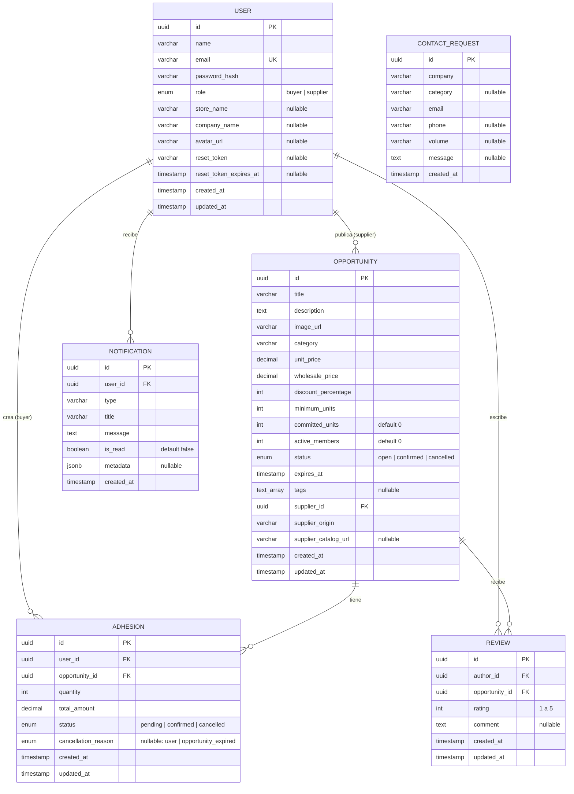
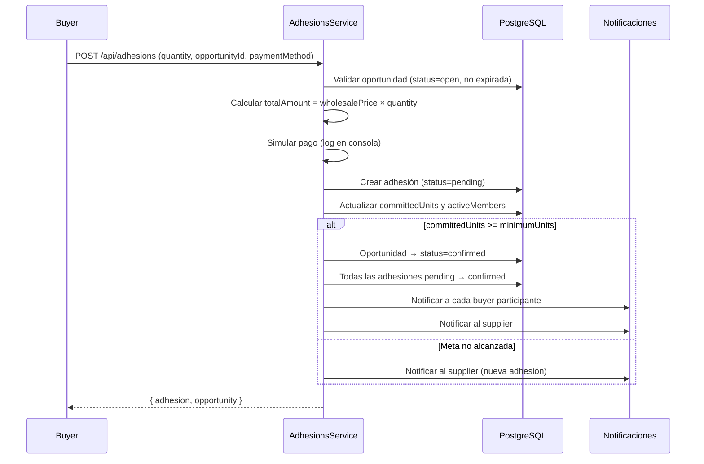

# MiniMax Backend — Arquitectura del Sistema

## Visión General

MiniMax es una plataforma de **compras grupales mayoristas** que conecta minoristas (buyers) con proveedores (suppliers). El backend está construido con una arquitectura modular basada en **NestJS**, donde cada dominio de negocio se encapsula en un módulo independiente con su propia entidad, servicio, controlador y DTOs.

### Stack Tecnológico

| Capa | Tecnología | Versión |
|---|---|---|
| Runtime | Node.js | 20+ |
| Framework | NestJS (Express) | 11.x |
| Base de Datos | PostgreSQL | 17 |
| ORM | TypeORM | 0.3.x |
| Autenticación | JWT (Passport) | — |
| Validación | class-validator + class-transformer | — |
| Tareas Programadas | @nestjs/schedule (cron) | — |

---

## Estructura de Módulos

```
src/
├── main.ts                          # Punto de entrada (CORS, ValidationPipe, prefijo /api)
├── app.module.ts                    # Módulo raíz (TypeORM, ConfigModule, ScheduleModule)
├── seed.ts                          # Script de datos iniciales
└── modules/
    ├── auth/                        # Registro, login, JWT, reset password
    │   ├── decorators/              # @Roles(), @CurrentUser()
    │   ├── dto/                     # RegisterDto, LoginDto, ForgotPasswordDto, ResetPasswordDto
    │   ├── guards/                  # JwtAuthGuard, RolesGuard
    │   ├── strategies/              # JwtStrategy (Passport)
    │   ├── auth.controller.ts
    │   ├── auth.service.ts
    │   └── auth.module.ts
    ├── users/                       # Gestión de usuarios
    │   ├── entities/user.entity.ts
    │   ├── users.service.ts
    │   └── users.module.ts
    ├── opportunities/               # CRUD de oportunidades + cron de expiración
    │   ├── entities/opportunity.entity.ts
    │   ├── dto/                     # CreateOpportunityDto, UpdateOpportunityDto, OpportunityQueryDto
    │   ├── opportunities.controller.ts
    │   ├── opportunities.service.ts
    │   └── opportunities.module.ts
    ├── adhesions/                   # Adhesiones (checkout simulado)
    │   ├── entities/adhesion.entity.ts
    │   ├── dto/create-adhesion.dto.ts
    │   ├── adhesions.controller.ts
    │   ├── adhesions.service.ts
    │   └── adhesions.module.ts
    ├── notifications/               # Sistema de notificaciones internas
    │   ├── entities/notification.entity.ts
    │   ├── notifications.controller.ts
    │   ├── notifications.service.ts
    │   └── notifications.module.ts
    ├── reviews/                     # Valoraciones de oportunidades
    │   ├── entities/review.entity.ts
    │   ├── dto/create-review.dto.ts
    │   ├── reviews.controller.ts
    │   ├── reviews.service.ts
    │   └── reviews.module.ts
    ├── contact/                     # Formulario de contacto para proveedores
    │   ├── entities/contact-request.entity.ts
    │   ├── dto/create-contact-request.dto.ts
    │   ├── contact.controller.ts
    │   ├── contact.service.ts
    │   └── contact.module.ts
    └── health/                      # Health check
        ├── health.controller.ts
        └── health.module.ts
```

---

## Modelo de Datos (Entidad-Relación)



---

## Descripción de Entidades

### User (tabla `users`)
Representa a los usuarios de la plataforma. El campo `role` determina si es un **minorista** (`buyer`) o un **proveedor** (`supplier`). Campos como `storeName` son exclusivos de buyers y `companyName` de suppliers. Los campos `resetToken` y `resetTokenExpiresAt` soportan el flujo de recuperación de contraseña.

**Relaciones:**
- Un `User` (supplier) puede publicar muchas `Opportunity`.
- Un `User` (buyer) puede crear muchas `Adhesion`.
- Un `User` recibe muchas `Notification`.
- Un `User` (buyer) puede escribir muchas `Review`.

### Opportunity (tabla `opportunities`)
Representa una oportunidad de **compra grupal mayorista** publicada por un proveedor. Los minoristas se adhieren aportando unidades hasta alcanzar el `minimumUnits`. Posee dos **getters virtuales** calculados en tiempo de ejecución:
- `progressPercent`: porcentaje de avance hacia la meta.
- `remainingUnits`: unidades faltantes para confirmar la compra.

**Ciclo de vida (estados):**
```
open → confirmed    (cuando committedUnits >= minimumUnits)
open → cancelled    (cuando expiresAt < ahora, via cron job)
```

**Relaciones:**
- Pertenece a un `User` (supplier) a través de `supplierId`.
- Tiene muchas `Adhesion`.
- Tiene muchas `Review`.

### Adhesion (tabla `adhesions`)
Representa la **participación de un minorista** en una oportunidad de compra grupal. Cada adhesión registra la cantidad de unidades comprometidas y el monto total calculado en base al `wholesalePrice`.

**Ciclo de vida (estados):**
```
pending → confirmed     (cuando la oportunidad alcanza la meta)
pending → cancelled     (por el usuario manualmente, o por expiración)
```

**Relaciones:**
- Pertenece a un `User` (buyer) a través de `userId`.
- Pertenece a una `Opportunity` a través de `opportunityId`.

### Notification (tabla `notifications`)
Almacena las **notificaciones internas** generadas automáticamente por el sistema. Incluye un campo `metadata` (JSONB) para datos adicionales como IDs de oportunidades o adhesiones relacionadas.

**Tipos de notificación:**
| Tipo | Cuándo se genera |
|---|---|
| `opportunity_confirmed` | La oportunidad alcanza la meta de unidades |
| `opportunity_expired` | La oportunidad expira sin completarse (cron) |
| `adhesion_cancelled` | Un minorista cancela su adhesión |
| `new_adhesion` | Un minorista se une a la oportunidad del proveedor |

### Review (tabla `reviews`)
Representa una **valoración** (1-5 estrellas + comentario opcional) dejada por un minorista sobre una oportunidad confirmada en la que participó. Existe una restricción de unicidad `UNIQUE(authorId, opportunityId)` que impide calificar la misma oportunidad dos veces.

**Reglas de negocio:**
- Solo se pueden calificar oportunidades con estado `confirmed`.
- Solo minoristas con adhesión `confirmed` en esa oportunidad pueden calificar.

### ContactRequest (tabla `contact_requests`)
Registra las **solicitudes de contacto** de proveedores interesados en publicar en la plataforma, enviadas desde la landing page pública. Es una entidad independiente sin relaciones.

---

## Flujos de Negocio Clave

### 1. Autenticación y Autorización

El sistema utiliza **JWT** (JSON Web Tokens) con estrategia Passport. El token se genera al registrarse o iniciar sesión y se envía en el header `Authorization: Bearer <token>`.

```
Registro/Login → JWT generado → Header en cada petición protegida
                                      ↓
                              JwtAuthGuard (verifica token)
                                      ↓
                              RolesGuard (verifica rol si aplica)
```

El flujo de **recuperación de contraseña** genera un token aleatorio de 32 bytes con expiración de 1 hora. En el MVP, el enlace de restablecimiento se imprime en la consola del servidor.

### 2. Compra Grupal (Adhesión + Confirmación Automática)



### 3. Expiración Automática (Cron Job)

Se ejecuta cada hora (`0 * * * *`). Busca oportunidades con `status=open` y `expiresAt <= now()`:

1. Cambia el estado de la oportunidad a `cancelled`.
2. Cancela todas las adhesiones pendientes con razón `opportunity_expired`.
3. Genera notificaciones para cada comprador afectado y para el proveedor.

---

## Tabla de Endpoints

| Método | Ruta | Auth | Rol | Descripción |
|---|---|---|---|---|
| `GET` | `/api/health` | ❌ | — | Health check |
| `POST` | `/api/auth/register` | ❌ | — | Registrar usuario |
| `POST` | `/api/auth/login` | ❌ | — | Iniciar sesión |
| `GET` | `/api/auth/me` | ✅ | — | Perfil actual |
| `POST` | `/api/auth/forgot-password` | ❌ | — | Solicitar reset |
| `POST` | `/api/auth/reset-password` | ❌ | — | Resetear contraseña |
| `GET` | `/api/opportunities` | ❌ | — | Listar con filtros |
| `GET` | `/api/opportunities/:id` | ❌ | — | Detalle de oportunidad |
| `POST` | `/api/opportunities` | ✅ | supplier | Crear oportunidad |
| `PATCH` | `/api/opportunities/:id` | ✅ | supplier | Editar oportunidad |
| `DELETE` | `/api/opportunities/:id` | ✅ | supplier | Eliminar oportunidad |
| `POST` | `/api/adhesions` | ✅ | buyer | Unirse a oportunidad |
| `GET` | `/api/adhesions/my` | ✅ | — | Mis adhesiones |
| `PATCH` | `/api/adhesions/:id/cancel` | ✅ | — | Cancelar adhesión |
| `GET` | `/api/notifications` | ✅ | — | Mis notificaciones |
| `PATCH` | `/api/notifications/:id/read` | ✅ | — | Marcar como leída |
| `PATCH` | `/api/notifications/read-all` | ✅ | — | Marcar todas leídas |
| `POST` | `/api/reviews` | ✅ | — | Crear valoración |
| `GET` | `/api/users/:id/reviews` | ❌ | — | Reviews de un usuario |
| `GET` | `/api/opportunities/:id/reviews` | ❌ | — | Reviews de oportunidad |
| `POST` | `/api/contact` | ❌ | — | Formulario de contacto |

---

## Configuración y Variables de Entorno

Todas las configuraciones sensibles se inyectan mediante `@nestjs/config` (`ConfigService`) y se leen del archivo `.env`. No hay valores hardcodeados en el código.

| Variable | Descripción | Valor por defecto |
|---|---|---|
| `PORT` | Puerto del servidor | `3001` |
| `FRONTEND_URL` | Origen permitido para CORS | `http://localhost:5173` |
| `DB_HOST` | Host de PostgreSQL | `localhost` |
| `DB_PORT` | Puerto de PostgreSQL | `5432` |
| `DB_USERNAME` | Usuario de la BD | `postgres` |
| `DB_PASSWORD` | Contraseña de la BD | `postgres` |
| `DB_NAME` | Nombre de la BD | `minimax_dev` |
| `JWT_SECRET` | Clave secreta para firmar tokens | — |
| `JWT_EXPIRES_IN` | Tiempo de expiración del JWT | `7d` |

---

## Decisiones Técnicas Relevantes

1. **`synchronize: true`**: TypeORM sincroniza automáticamente el esquema de la BD en desarrollo. En producción, debe desactivarse y usar migraciones.
2. **Getters virtuales**: `progressPercent` y `remainingUnits` no se almacenan en la BD; se calculan en el servicio mediante `mapOpportunity()` para asegurar su serialización correcta en JSON.
3. **Simulación de pagos**: El proceso de pago se simula mediante logs en consola. No hay integración real con pasarelas.
4. **Contraseñas**: Se hashean con `bcrypt` (10 salt rounds). Nunca se exponen en las respuestas de la API.
5. **TypeScript estricto**: `strict: true`, `strictNullChecks: true`, `noImplicitAny: true` habilitados en `tsconfig.json`.
6. **Validación global**: `ValidationPipe` con `whitelist: true`, `transform: true` y `forbidNonWhitelisted: true` rechaza propiedades no declaradas en los DTOs.
